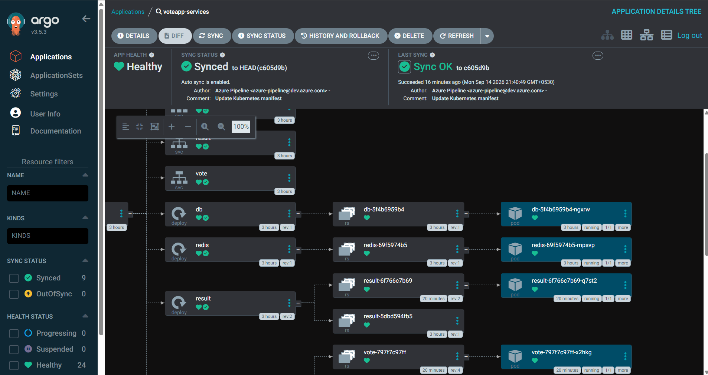
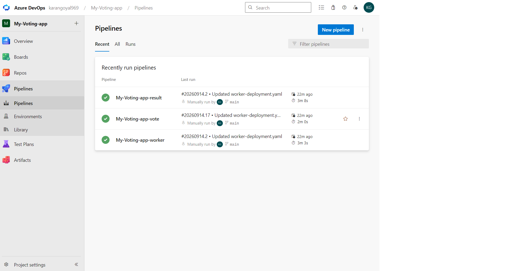
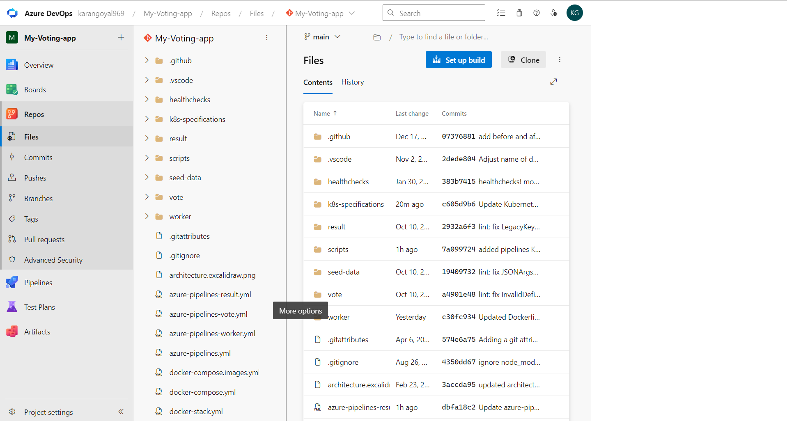
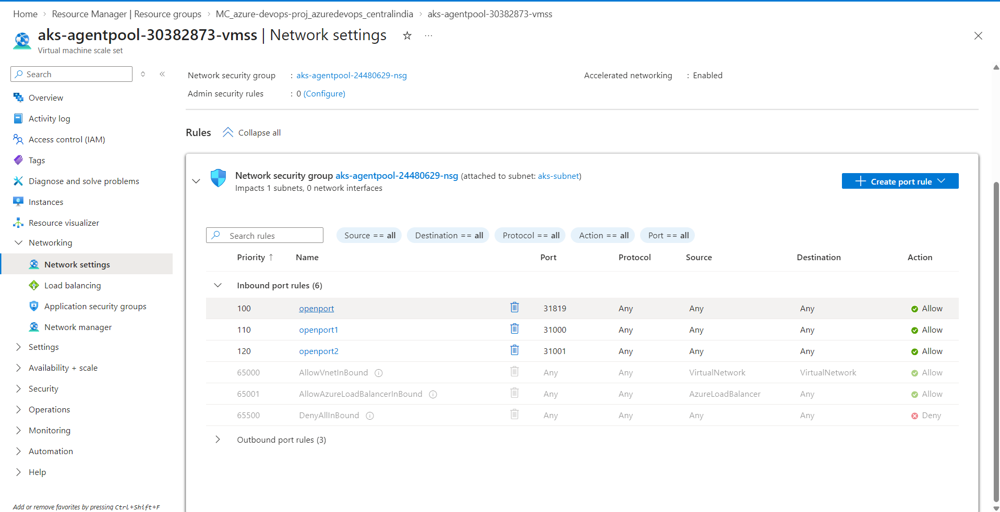
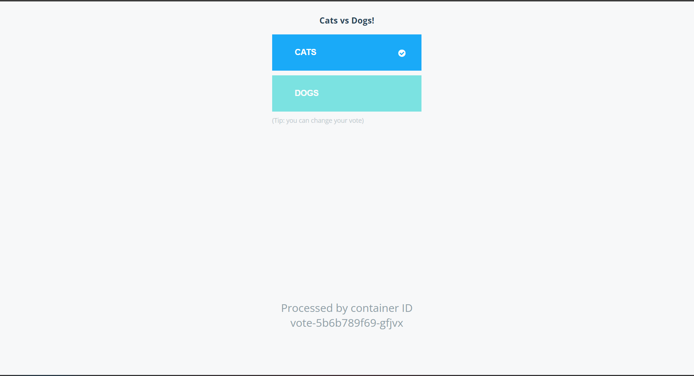
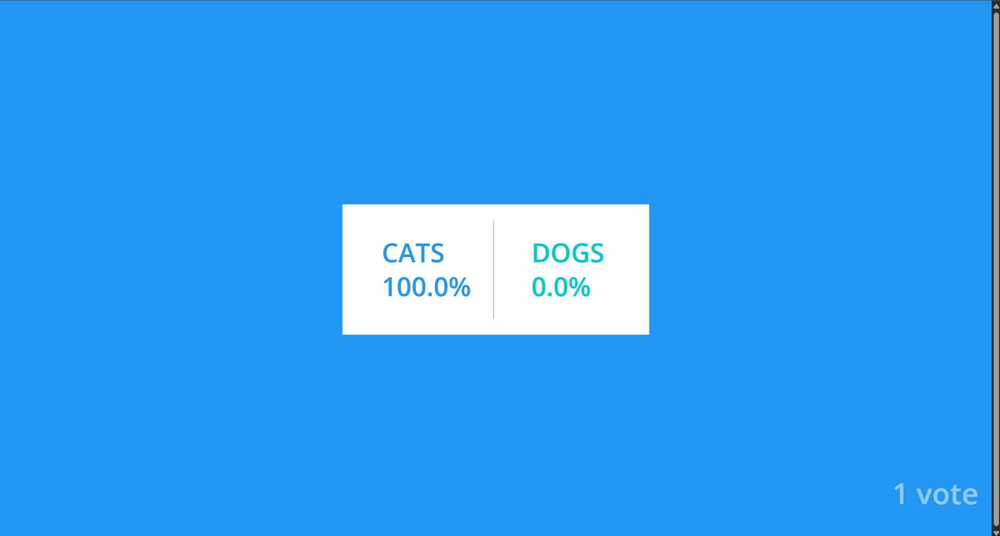

# Azure DevOps CI/CD + Kubernetes GitOps – Example Voting App

This project demonstrates a complete, end-to-end **CI/CD and GitOps workflow** built on **Azure DevOps**, **Kubernetes**, and **ArgoCD**, using the popular open-source [Example Voting App](https://github.com/KaranGoyal134/example-voting-app.git) as the sample application.

The goal of this project is to showcase practical, hands-on experience across the full DevOps lifecycle: repository integration, self-hosted agents, container registries, Kubernetes deployment, and GitOps-driven continuous delivery.

## Project Overview

The Example Voting App is a microservices-based application made up of three main services:

- **vote** – a front-end web app where users cast votes
- **worker** – a background service that processes votes
- **result** – a web app that displays voting results in real time

Each of these services is containerized using Docker. This project builds a separate CI pipeline for each service and deploys all of them to a Kubernetes cluster using GitOps principles with ArgoCD.

## What This Project Demonstrates

### 1. Continuous Integration (Azure DevOps)

- **Source Control Integration** – The application source code was forked/imported into an Azure DevOps organization and connected to Azure Repos so pipelines could be built directly against it.
- **Self-Hosted Agent Setup** – A self-hosted agent (`azureagent`) was configured and registered instead of using Microsoft-hosted agents, authenticated using a Personal Access Token (PAT).
- **Azure Container Registry (ACR)** – A registry named `karanazuredevops` stores the Docker images, with one repository per service: `result`, `voteapp`, `worker`.
- **Custom Build & Push Pipelines** – The built-in "build + push" Docker task was intentionally split into two separate steps (build, then push) for clearer, more granular visibility into each pipeline stage.
- **Three Independent Pipelines** – One pipeline per microservice (`vote`, `worker`, `result`), each running on the `azureagent` self-hosted agent.

### 2. Continuous Deployment via GitOps

- **Kubernetes Cluster** – A Kubernetes cluster was provisioned to host the application workloads.
- **ArgoCD for GitOps** – ArgoCD was installed on the cluster and configured to continuously watch the `k8s-specifications/` folder in this repository as its source of truth. Any change committed to the manifests in that folder is automatically synced and applied to the cluster by ArgoCD.
- **Automated Image Tag Updates** – A new pipeline step was added that runs a shell script, `scripts/script.sh`, whenever a new image is built and pushed. The script updates the image tag reference inside the Kubernetes manifests in `k8s-specifications/` and commits the change back to the repository. This is the step that "bridges" CI and CD:
  1. CI pipeline builds and pushes a new Docker image to ACR.
  2. `scripts/script.sh` updates the corresponding image tag in the Kubernetes manifests.
  3. The updated manifest is pushed back to Git.
  4. ArgoCD detects the change in Git and automatically syncs/deploys it to the cluster.
- **Private Registry Access via Image Pull Secrets** – Since images are stored in a private ACR repository, a Kubernetes image pull secret named `acr-secret` was created and referenced in the deployment manifests so the cluster can authenticate and pull images from ACR.
- **NodePort Service Exposure** – The `vote` and `result` services are exposed via NodePort, making the voting UI and results UI accessible directly on the cluster node's IP and port.
- **ArgoCD UI Access** – The ArgoCD server port was forwarded locally, allowing the ArgoCD dashboard to be accessed to visually track application sync status and deployment history.

## End-to-End Architecture Flow

```
      Developer pushes code change
                   │
                   ▼
      ┌──────────────────────────┐
      │       Azure Repos        │
      │      (Source Code)       │
      └────────────┬─────────────┘
                   │
                   ▼
      ┌──────────────────────────┐
      │     Azure Pipelines      │
      │ (vote / worker / result) │
      │  ┌────────────────────┐  │
      │  │  Build Docker Image│  │
      │  └─────────┬──────────┘  │
      │            ▼             │
      │  ┌────────────────────┐  │
      │  │  Push Image to ACR │  │
      │  └─────────┬──────────┘  │
      │            ▼             │
      │ ┌─────────────────────┐  │
      │ │Run scripts/script.sh│  │
      │ │ (update image tag   │  │
      │ │in k8s-specification)│  │
      │ └──────────┬──────────┘  │
      └────────────┼─────────────┘
                   ▼
      ┌──────────────────────────┐
      │ Git commit: updated tag  │
      │ pushed back to repo      │
      └────────────┬─────────────┘
                   ▼
      ┌──────────────────────────┐
      │          ArgoCD          │
      │watches k8s-specifications│
      │  auto-syncs on change    │
      └────────────┬─────────────┘
                   ▼
      ┌──────────────────────────┐
      │    Kubernetes Cluster    │
      │  ┌────────────────────┐  │
      │  │  vote (NodePort)   │  │
      │  ├────────────────────┤  │
      │  │  worker            │  │
      │  ├────────────────────┤  │
      │  │  result (NodePort) │  │
      │  └────────────────────┘  │
      │  Pulls images using      │
      │  imagePullSecret:        │
      │  acr-secret              │
      └──────────────────────────┘
```

## Tech Stack

- **Azure DevOps** – Repos, Pipelines, Agent Pools
- **Azure Container Registry (ACR)** – Docker image storage
- **Docker** – Containerization of services
- **Self-hosted Agent** – Custom build agent (`azureagent`)
- **Kubernetes** – Container orchestration cluster
- **ArgoCD** – GitOps continuous delivery, syncing `k8s-specifications/`
- **Shell Scripting** – `scripts/script.sh` for automated image tag updates
- **Kubernetes Secrets** – `acr-secret` for private registry authentication (imagePullSecrets)
- **NodePort Services** – Exposing `vote` and `result` UIs externally

## How It All Fits Together (CI + CD)

1. Code is pushed to Azure Repos.
2. Azure Pipelines build and push the updated Docker image to ACR.
3. The pipeline runs `scripts/script.sh`, which updates the image tag in the relevant manifest under `k8s-specifications/` and pushes that change to Git.
4. ArgoCD, watching `k8s-specifications/`, detects the Git change and automatically syncs the new manifest to the Kubernetes cluster.
5. Kubernetes pulls the new image from ACR using the `acr-secret` image pull secret and rolls out the updated pods.
6. The updated `vote` and `result` apps are immediately accessible via their NodePort services, and the whole rollout can be observed live in the ArgoCD UI.

This closes the loop from **code commit → image build → image push → manifest update → GitOps sync → live deployment**, with no manual `kubectl apply` required.

## Screenshots

**GitOps / ArgoCD setup**


**CI Pipelines**

Successful pipeline runs for all three services (vote, worker, result):


**Infrastructure**

Azure Repos:


VMSS Network Security Group :


**Deployed Application**

Vote app UI:


Result app UI:


## Purpose

This project was built as a learning and portfolio exercise to demonstrate practical, end-to-end DevOps skills — spanning CI pipeline design, container registry integration, Kubernetes deployment, and GitOps-based continuous delivery with ArgoCD — using a real multi-service application as the example workload.